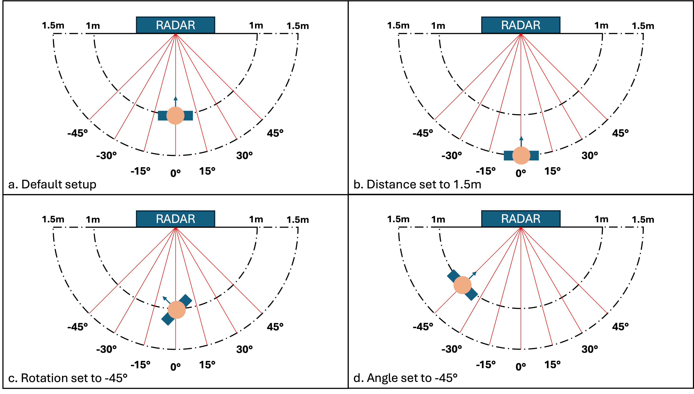
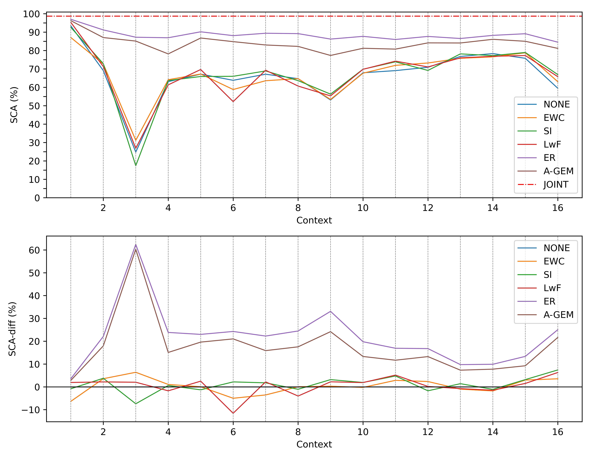
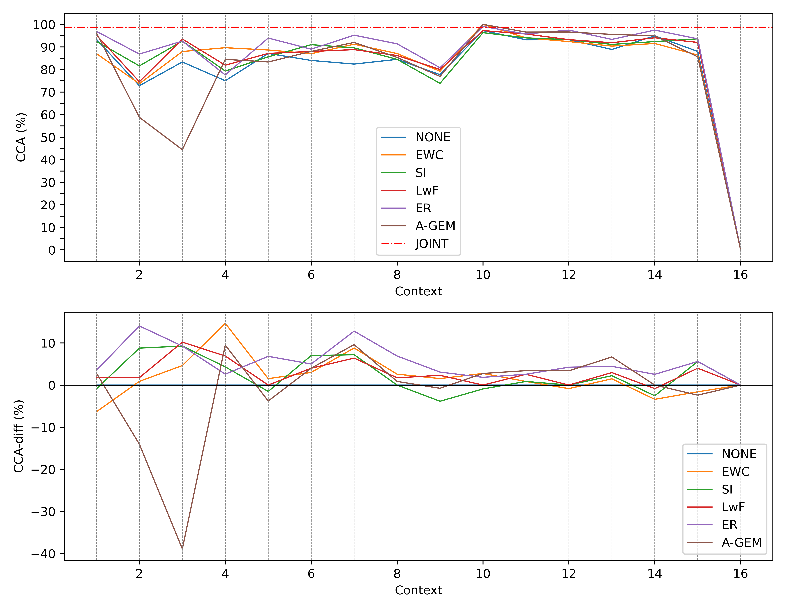
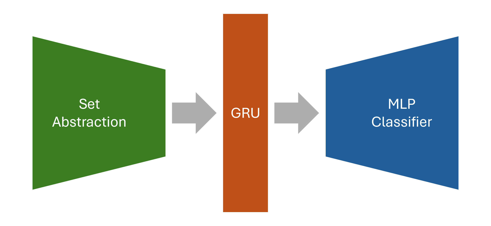

# Robust Fine-Grained Gesture Recognition via Continual Learning

**Bachelor's thesis, Aalto University** 

- **Major:** Digital Systems and Design
- **Author:** Vu Minh Nguyen
- **Supervisor:** Dr. Salu Ylirisku
- **Advisor:** Yuqing Song
- **Period:** June – September 2025
- **Grade:** 5 / 5

---

## TL;DR

A radar-based gesture recognition model works well in a fixed setting. When the setting changes (new users, new distances or angles, new gestures) and you keep training on the new data only, the model forgets what it learned before. This is called **catastrophic forgetting**.

I implemented **five continual learning methods** in PyTorch on top of an existing point-cloud + GRU gesture classifier, and benchmarked them over a stream of **16 changing contexts**:

- Parameter regularization: **Elastic Weight Consolidation (EWC)**, **Synaptic Intelligence (SI)**
- Functional regularization: **Learning without Forgetting (LwF)**
- Replay: **Experience Replay (ER)**, **Averaged Gradient Episodic Memory (A-GEM)**

**Result:** the replay methods clearly beat the regularization methods. With a buffer of only 300 samples (about 3% of the training set), **ER raises final test accuracy from 59.7% to 85.0% (+25.3 pp)**. EWC, SI and LwF add only 4–7 pp.

---

## Problem setup

The data is a stream of mmWave radar recordings of finger gestures. Each sample is a sequence of 28 frames, and each frame is a point cloud of 120 points with `(x, y, z, speed, amplitude)`. There are 16 gesture classes and ~16k samples.

The model sees the data as **16 contexts, one after another**. Each context changes something about the recording setup:

| Context | What changes |
|---|---|
| 1 | Base setup (0° rotation, 0° angle, 1 m) |
| 2 | A different group of participants |
| 3 | Distance increased to 1.5 m |
| 4–9 | Body rotation ±10° … ±45° |
| 10–15 | Viewing angle ±15° … ±45° |
| 16 | **Four new gesture classes** (class-incremental step) |



Contexts 1–15 are a *domain-incremental* problem: same 12 classes, new conditions each time. Context 16 is *class-incremental*: it adds new classes.

---

## What I did

### 1. Implemented the continual learning methods

Each regularization method is a loss module with `run_post_iteration()` / `run_post_context()` hooks. The training loop calls these hooks, so every method plugs into the same pipeline.

| Method | Type | Implementation details |
|---|---|---|
| **EWC** | Parameter regularization | Computes the diagonal Fisher information after each context. A quadratic penalty keeps important weights close to their earlier values. |
| **SI** | Parameter regularization | Tracks each parameter's contribution to the loss decrease online, during every iteration. This is turned into an importance weight Ω at the end of each context. |
| **LwF** | Functional regularization | Keeps a frozen copy of the previous model. A temperature-scaled distillation loss makes the new model match the old model's outputs on current inputs. |
| **ER** | Replay | Uses a fixed-budget memory buffer split evenly across the contexts seen so far. It is re-balanced after each context, and the buffer is mixed into the training set. |
| **A-GEM** | Replay | Computes a reference gradient on a sample from the buffer. If the current gradient conflicts with it (negative dot product), the current gradient is projected so old contexts are not hurt. |
| **None / Joint** | Baselines | Naive fine-tuning is the lower bound. Training on all data at once is the upper bound. |

I also wrote the continual (context-by-context) data loading and the training and evaluation loop around it.

### 2. Designed the benchmark

- **Metrics**
  - **FTA**: final test accuracy.
  - **CCA**: current-context accuracy, which measures how well the model learns new data (plasticity).
  - **SCA**: seen-context accuracy on all contexts so far, which measures how much it remembers (stability).
  - Each metric is also reported as the difference from the None baseline.
- **Protocol:** 60/20/20 split, 14 epochs per context (224 epochs in total), and a replay buffer of 300 samples.
- **Hyperparameter search:** a log-scale sweep of λ ∈ {0.01, 0.1, 1, 10, 100} for EWC, SI and LwF. The best λ maximizes average CCA + average SCA.

### 3. Ran the experiments and analysed them

I wrote the plotting and reporting scripts that produced every figure below.

---

## Results

### Final test accuracy

| Method | FTA | vs. None |
|---|---:|---:|
| Joint (upper bound) | 98.8% | – |
| **ER** | **85.0%** | **+25.3 pp** |
| **A-GEM** | **81.9%** | **+22.2 pp** |
| SI | 66.7% | +7.0 pp |
| LwF | 64.8% | +5.1 pp |
| EWC | 63.8% | +4.1 pp |
| None (lower bound) | 59.7% | 0.0 |

### Seen-context accuracy (how much the model remembers)

ER and A-GEM stay at 80–90% across the whole stream. The regularization methods track the None baseline closely and collapse in context 3 (the 1.5 m distance).



### Current-context accuracy (how well the model learns new data)

All methods adapt well to each new domain. ER is the only method that never falls below the baseline. A-GEM gives up plasticity in contexts 2–3 to stay stable. Every incremental method drops to 0% in context 16, when new classes appear.



### Hyperparameter tuning

Each point is one λ value, plotted by the average plasticity (CCA) and stability (SCA) it gives. The selected values are λ = 10 for EWC, λ = 0.1 for SI and λ = 1 for LwF.


### Takeaways

- **Keeping a small amount of real past data works much better than regularization.** With ~3% of the data in a buffer, replay closes most of the gap to full retraining.
- **Protecting "important" weights (EWC/SI) can backfire under domain shift.** Parameters that were optimal for one context can be the wrong ones for the joint distribution.
- **LwF distils from a model that never saw the new domain**, so its soft targets can be uninformative.
- **Adding new classes late is still unsolved here.** After more than 200 epochs on 12 classes, the classifier is strongly biased against the 4 new logits. This points to future work on bias correction and classifier re-balancing.

---

## Credits and scope of this repository

This thesis was built on existing work by my advisor, Yuqing Song:

- **Data collection**: the radar gesture recordings.
- **Data preprocessing**: converting raw radar output to point-cloud frame sequences.
- **Base model**: the PointNet++ set-abstraction + GRU + MLP classifier that the continual learning methods are applied to.



My contribution is everything **on top of** that base: the continual learning methods, the continual training pipeline, the benchmark design, hyperparameter tuning, experiments, and analysis.

The set-abstraction layers and the training-script skeleton come from the open-source [PointNet/PointNet++ PyTorch implementation](https://github.com/yanx27/Pointnet_Pointnet2_pytorch) by Xu Yan.

### What is and isn't published

This repository contains **only the deep learning code**: the base model and the continual learning methods built on it. It was published with my advisor's permission.

The following are **not included**:

- **The dataset**: the raw radar recordings and the processed point clouds.
- **The data collection and preprocessing pipeline**: the MATLAB project that turns raw radar output into point-cloud sequences, plus the `.mat` → `.txt` conversion scripts.

Because of this, the training code cannot be run as-is. It expects the preprocessed data under `data/bigdata_12_classes/`.

---

## Code

```
train_classification.py   training entry point: runs one CL method over all 16 contexts
test_models.py            evaluates the final checkpoints on the test split
provider.py               point-cloud augmentation
models/
  pointnet2-bi-gru.py     base model + CL losses (EWC, SI, LwF) and the A-GEM gradient projection
  memory_buffer.py        fixed-budget, context-balanced replay buffer (ER, A-GEM)
  pointnet2_utils.py      PointNet++ set-abstraction layers
data_utils/               context definitions and a dataset loader for the preprocessed point clouds
plotting_scripts/         metric DTOs, per-run plotting, and the scripts that produce the thesis figures
  plots/                  generated figures (incl. extended CCA/SCA and training accuracy per epoch)
img/                      figures used in this README
thesis.pdf                the full thesis
```

Training (one run = one method over all 16 contexts):

```bash
# method: NONE | JOINT | EWC | SI | LwF | ER | AGEM
python train_classification.py --method EWC --reg_strength 10
python train_classification.py --method SI  --reg_strength 0.1
python train_classification.py --method LwF --reg_strength 1
python train_classification.py --method ER  --buffer_size 300
python train_classification.py --method AGEM --buffer_size 300

python test_models.py
```
